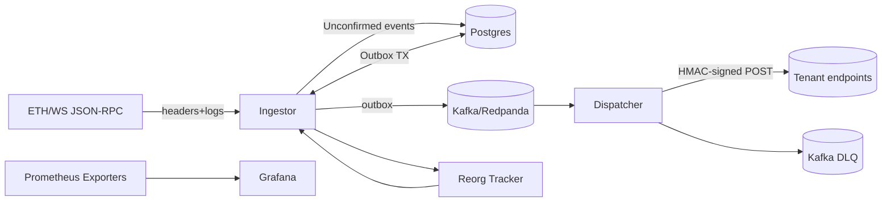

# ForkGuard

**Reorg-aware, exactly-once EVM event delivery to Kafka and Webhooks.**

ForkGuard is a robust infrastructure service that provides a durable, reorg-safe pipeline for Ethereum Virtual Machine (EVM) events. It ingests raw blockchain logs, manages confirmation and fork-related state changes, and guarantees reliable, exactly-once delivery to downstream systems like Kafka topics and signed HTTPS webhooks.

## Architecture

ForkGuard is designed as a distributed system of specialized microservices that work together to ensure data consistency and high availability. The flow of data is unidirectional, moving from the blockchain through ingestion, confirmation, and finally to dispatch.

### Core Components

*   **Ingestor**: Subscribes to an EVM node's WebSocket RPC to receive new blocks and logs in real-time. It's responsible for writing raw event data to the database and managing the confirmation lifecycle of each block.
*   **Reorg Tracker**: A sub-component of the Ingestor that maintains a chain of recent block hashes. Upon detecting a fork (a parent hash mismatch), it identifies the orphaned blocks and triggers a rollback.
*   **Dispatcher**: Consumes a stream of `CONFIRMED` and `RETRACTED` events from Kafka. It matches these events against user-defined subscriptions and delivers them to the specified webhook endpoints with guarantees of security and reliability.
*   **Admin API**: A simple HTTP service for managing user subscriptions and monitoring the health of the system.

### Key Concepts

*   **Reorg Safety**: ForkGuard is fundamentally aware of blockchain reorganizations. When a fork occurs, it automatically identifies affected events, marks them as `RETRACTED`, and publishes new `CONFIRMED` events from the correct canonical chain.
*   **Transactional Outbox**: To guarantee that the database state and the messages sent to Kafka are always consistent, ForkGuard uses the Transactional Outbox pattern. Database writes and event creation are performed in a single atomic database transaction. A separate process then reliably publishes these events to Kafka.
*   **Exactly-Once Delivery**: For webhooks, ForkGuard provides exactly-once delivery semantics through a combination of idempotent request keys, persistent delivery attempt tracking in Postgres, and a Redis layer for short-term deduplication. Failed deliveries are retried with exponential backoff and are eventually sent to a Dead-Letter Queue (DLQ) for manual inspection.

## Technology

**Stack**: Go, PostgreSQL, Kafka (Redpanda), Redis, Docker, Prometheus, Grafana